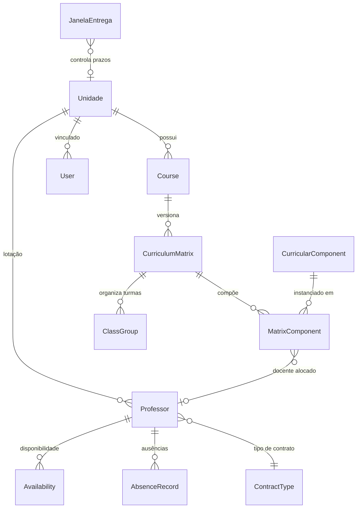

<p align="center">
  
</p>

<h1 align="center">AllocGest-DESUP</h1>

<p align="center">
  <strong>Sistema de Gestão e Alocação de Professores para Coordenação Acadêmica</strong>
</p>

<p align="center">
  
  
  
  
  
  
</p>

<p align="center">
  <a href="#-sobre-o-projeto">Sobre</a> •
  <a href="#-funcionalidades">Funcionalidades</a> •
  <a href="#%EF%B8%8F-arquitetura">Arquitetura</a> •
  <a href="#-como-executar">Como Executar</a> •
  <a href="#-regras-de-negócio">Regras de Negócio</a> •
  <a href="#-perfis-de-acesso">Perfis</a> •
  <a href="#-roadmap">Roadmap</a>
</p>

---

## 📋 Sobre o Projeto

O **AllocGest-DESUP** é uma plataforma web institucional desenvolvida para a **Diretoria de Ensino Superior (DESUP)**, com o objetivo de **substituir processos manuais baseados em planilhas** por um sistema centralizado, seguro e auditável de gestão acadêmica.

O foco principal é a **alocação de professores** em disciplinas, turmas e atividades extracurriculares, respeitando regras institucionais rigorosas de carga horária, contratos, cessão, e controle por unidade de ensino.

### Por que este sistema existe?

| Antes (Planilhas)                         | Depois (AllocGest)                              |
|-------------------------------------------|--------------------------------------------------|
| Dados descentralizados por unidade        | Visão consolidada com isolamento por perfil      |
| Controle manual de carga horária          | Travas automáticas de teto (20h sala / 40h total)|
| Sem rastreabilidade de alterações         | Auditoria completa (quem, quando, o quê)         |
| Risco de inconsistência entre RH e DESUP  | Separação lógica de banco RH vs camada DESUP     |
| Sem controle de prazos institucionais     | Janela semestral com abertura/fechamento/reabertura|

---

## ✨ Funcionalidades

### 🎓 Gestão Acadêmica
- **Matriz Curricular** — Cadastro versionado de matrizes com componentes curriculares, disciplinas compartilhadas, períodos e distribuição semanal
- **Cursos e Turmas** — Organização hierárquica por unidade com suporte a múltiplos turnos (Manhã, Tarde, Noite)
- **Componentes Curriculares** — Catálogo reutilizável com carga horária padrão, créditos e pré-requisitos

### 👨‍🏫 Gestão de Professores
- **Cadastro com dupla camada** — Dados originais do RH preservados + sobrescritas controladas pela DESUP
- **Contratos configuráveis** — Ensino Superior (20h sala), BTT (10h/24 tempos) e outros regimes
- **Cessão e Carência** — Rastreamento de professores cedidos com impacto automático na unidade de origem
- **Status dinâmico** — Ativo, Ausente/Afastado com alertas visuais no dashboard

### 📊 Alocação Inteligente
- **Alocação Curricular** — Vinculação professor ↔ disciplina ↔ turma com validação automática de teto
- **4 estados distintos** — COMPLETO, INCOMPLETO, SEM PROFESSOR, NÃO OFERECIDA
- **Alocação Extracurricular** — TCC, extensão, pesquisa, redução de CH com workflow de aprovação
- **Cálculo automático** — CH alocada, CH justificada, CH não alocada e percentual de alocação

### 🔒 Segurança e Controle
- **Isolamento multi-tenant** — `UnitBoundManager` garante que cada unidade vê apenas seus dados
- **3 perfis de acesso** — SuperAdmin, Admin (DESUP), Usuário-Unidade
- **Proteção server-side** — Toda autorização validada no backend, nunca apenas no front-end
- **Bloqueio de login** — Throttle após 5 tentativas falhas
- **Janela semestral** — Controle de prazos com estados Aberto/Fechado/Reaberto

### 📈 Dashboards e Relatórios
- **Dashboard DESUP** — Visão consolidada de todas as unidades
- **Dashboard Unidade** — Visão focada nos professores e alocações da unidade
- **Indicadores visuais** — KPIs de alocação, carga horária e status de professores
- **Notificações** — Sistema de alertas contextuais por usuário e unidade

---

## 🏗️ Arquitetura

### Stack Tecnológica

| Camada        | Tecnologia                  | Papel                                          |
|---------------|-----------------------------|-------------------------------------------------|
| **Backend**   | Django 6.0                  | Framework principal, ORM, autenticação          |
| **Frontend**  | HTMX + Alpine.js            | Interatividade sem SPA, requests parciais       |
| **Estilo**    | TailwindCSS 4               | Design system utilitário                        |
| **Banco**     | PostgreSQL 16 / SQLite (dev)| Persistência com suporte a multi-tenant lógico  |
| **Cache/Fila**| Redis + Celery              | Cache compartilhado e tarefas assíncronas       |
| **Templates** | Django Templates            | Renderização server-side com componentes HTMX   |

### Estrutura do Projeto

```
AllocGest-DESUP/
├── 📁 project_root/              # Aplicação Django principal
│   ├── 📁 apps/
│   │   ├── 📦 accounts/          # Autenticação, perfis, User customizado
│   │   ├── 📦 allocations/       # Motor de alocação curricular
│   │   ├── 📦 core/              # Unidades, Janela de Entrega, UnitBoundManager
│   │   ├── 📦 courses/           # Cursos, Matrizes, Componentes, Turmas
│   │   ├── 📦 extra_curricular/  # Alocação extracurricular (TCC, extensão, etc.)
│   │   └── 📦 professors/        # Professores, Contratos, Disponibilidade, Ausências
│   ├── 📁 config/                # Settings (base/dev/prod), URLs, WSGI/ASGI
│   ├── 📁 templates/             # Templates Django organizados por app
│   ├── 📁 static/                # CSS, JS, imagens
│   ├── 📁 seeds/                 # Dados de seed para desenvolvimento
│   └── 📁 progress/              # Roadmap e documentação de progresso
├── 📁 docs/                      # Documentação técnica e prompts de agentes
├── 📁 ia_workflow/               # Escopos, relatórios de aferição, planos
└── 📄 agentes_strict_rules.md    # Regras estritas para agentes de IA
```

### Diagrama de Domínio



---

## 🚀 Como Executar

### Pré-requisitos

- Python 3.12+
- PostgreSQL 16+ (ou SQLite para desenvolvimento)
- Node.js 18+ (para TailwindCSS)
- Git

### Instalação

```bash
# 1. Clone o repositório
git clone https://github.com/estherquarterolli/AllocGest-DESUP.git
cd AllocGest-DESUP

# 2. Crie o ambiente virtual
python -m venv .venv

# 3. Ative o ambiente virtual
# Windows:
.venv\Scripts\activate
# Linux/Mac:
source .venv/bin/activate

# 4. Instale as dependências
cd project_root
pip install -r requirements.txt

# 5. Configure as variáveis de ambiente
copy .env.example .env
# Edite o arquivo .env com suas configurações
```

### Configuração do Banco

```bash
# Gerar migrações e aplicar
python manage.py makemigrations
python manage.py migrate

# Criar superusuário (perfil SuperAdmin)
python manage.py createsuperuser
# O sistema pedirá: e-mail, cpf e senha
```

### Executar

```bash
# Servidor de desenvolvimento
python manage.py runserver

# Acesse:
# 🌐 Sistema:  http://localhost:8000/
# ⚙️ Admin:    http://localhost:8000/admin/
```

### Variáveis de Ambiente

```env
SECRET_KEY=your-secret-key-here
DEBUG=True
ALLOWED_HOSTS=localhost,127.0.0.1
REDIS_URL=redis://localhost:6379/0
CELERY_BROKER_URL=redis://localhost:6379/0
CELERY_RESULT_BACKEND=redis://localhost:6379/0
```

### Worker

Quando Redis estiver habilitado no ambiente, o worker do Celery pode ser iniciado a partir da raiz de `project_root`:

```bash
celery -A config worker -l info
```

---

## 📐 Regras de Negócio

O sistema é regido por **15 regras de negócio institucionais** que devem ser respeitadas acima de qualquer conveniência técnica. A documentação completa está em [`docs/prompt-arquiteto-regras-negocio.md`](docs/prompt-arquiteto-regras-negocio.md).

### Regras Críticas

| #  | Regra                              | Resumo                                                                               |
|----|-------------------------------------|--------------------------------------------------------------------------------------|
| 1  | **Perfis de acesso**               | SuperAdmin, Admin, Usuário-Unidade — isolamento total entre unidades                 |
| 2  | **Autoridade institucional**       | Unidade não edita livremente após envio — alterações passam pela DESUP               |
| 3  | **Banco RH × DESUP**              | Dados do RH são read-only; edições ficam apenas na camada DESUP                      |
| 4  | **Cessão e RAT**                   | Professor cedido = carência; RAT sempre registrado de forma completa                 |
| 5  | **Carga horária docente**          | Ensino Superior: 20h sala / 40h total; BTT: 10h/24t (configurável)                  |
| 6  | **Horas ociosas justificadas**     | Motivo + contexto + vínculo institucional obrigatórios                                |
| 7  | **Justificativa de CH**            | Rascunho → Envio definitivo (com SEI obrigatório)                                    |
| 8  | **SEI**                            | Obrigatório para envio, sem validação de formato — campo de texto livre               |
| 9  | **Matriz curricular**              | Versionada, com 9 campos mínimos e disciplinas compartilhadas sinalizadas            |
| 10 | **Alocação curricular**            | 4 estados: COMPLETO, INCOMPLETO, SEM_PROFESSOR, NÃO_OFERECIDA                       |
| 11 | **Alocação extracurricular**       | TCC, extensão, pesquisa, redução — cada categoria com regras próprias                |
| 12 | **Prazo de entrega da matriz**     | Janela semestral controlada pela coordenação acadêmica (Aberto/Fechado/Reaberto)     |
| 13 | **Ausências e afastamentos**       | Registro com upload validado server-side; status muda automaticamente                |
| 14 | **Dashboards e relatórios**        | Escopo por unidade/perfil — indicadores de alunos fora do escopo                     |
| 15 | **Auditoria e segurança**          | Login por e-mail, bloqueio após 5 falhas, timeout 15min, trilha auditável            |

> **Regra de Ouro:** *Se houver conflito entre facilidade técnica e regra de negócio, a regra de negócio vence.*

---

## 👥 Perfis de Acesso

```
┌─────────────────────────────────────────────────────────┐
│                     SuperAdmin                          │
│  Acesso total • Admin Django • Testes • Suporte técnico │
├─────────────────────────────────────────────────────────┤
│                        Admin                            │
│  Coordenação DESUP • Visão global • Aprovar alterações  │
│  Gerenciar janelas • Editar camada DESUP                │
├─────────────────────────────────────────────────────────┤
│                   Usuário-Unidade                       │
│  Coordenador de Unidade • Dados da própria unidade      │
│  Cadastrar professores • Submeter matriz • Justificar   │
└─────────────────────────────────────────────────────────┘

⚠️ Professores NÃO logam no sistema.
   São entidades de domínio gerenciadas pelos coordenadores.
```

---

## 🗺️ Roadmap

O desenvolvimento segue ciclos de **3 dias de implementação + 2 dias de revisão/validação**.

| Ciclo | Fase                             | Status   |
|-------|----------------------------------|----------|
| 1     | Fundação (Auth, User, Perfis)    | ✅ Concluído |
| 2     | Modelagem Acadêmica (Courses)    | ✅ Concluído |
| 3     | Segurança e Multi-tenancy        | ✅ Concluído |
| 4     | Cadastros Operacionais (CRUDs)   | ✅ Concluído |
| 5     | Motor de Alocação Curricular     | ✅ Concluído |
| 6     | Extracurricular e Justificativas | 🔄 Em andamento |
| 7     | Dashboards Inteligentes          | 🔜 Próximo |
| 8     | QA Final, Hardening e Deploy     | ⬚ Pendente |

Detalhes completos em [`project_root/progress/mvp_roadmap_timeline.md`](project_root/progress/mvp_roadmap_timeline.md).

---

## 🧪 Testes

```bash
# Rodar todos os testes
python manage.py test -v 2

# Rodar testes de um app específico
python manage.py test apps.accounts.tests -v 2
python manage.py test apps.courses.tests -v 2
python manage.py test apps.allocations.tests -v 2
```

---

## 🤖 Workflow com IA

O projeto utiliza um workflow multi-agente para desenvolvimento assistido:

| Agente        | Papel                           | Arquivo de Contexto                    |
|---------------|---------------------------------|----------------------------------------|
| **Gemini**    | Coder — implementação rápida    | [`docs/gemini.md`](docs/gemini.md)     |
| **Claude Opus** | Reviewer — QA e code review  | [`docs/claude-opus.md`](docs/claude-opus.md) |
| **Arquiteto** | Especificação técnica           | [`docs/prompt-arquiteto-regras-negocio.md`](docs/prompt-arquiteto-regras-negocio.md) |

Todos os agentes estão obrigados a seguir as [`agentes_strict_rules.md`](agentes_strict_rules.md).

---

## 📄 Licença

Este projeto é de uso institucional interno da DESUP. Todos os direitos reservados.

---

<p align="center">
  <sub>Desenvolvido com ☕ para a Coordenação Acadêmica — DESUP</sub>
</p>
