# Diagramas PlantUML — Sistema HARPIA-DESUP

> Códigos prontos para **copiar e colar** em qualquer renderizador PlantUML
> (plantuml.com/plantuml, extensão do VS Code, IntelliJ, etc.).
> Cada bloco `@startuml … @enduml` é independente — cole um de cada vez.
>
> **Padrão visual adotado (todos os diagramas):**
> - Ator: **bonequinho padrão** (`skinparam actorStyle stickman`).
> - Paleta: **azul** (`#2563EB` / `#DBEAFE` / `#1E3A8A`) e **amarelo** (`#FDE68A` / `#FEF3C7` / `#B45309`).
> - Sem sombras, fundo branco, setas azuis.
>
> Diagramas cobertos (seções vazias do documento de elicitação):
> 1. Casos de Uso (Fig. 2 — §6.2)
> 2. Classes / Estrutura Acadêmica (§6.1)
> 3. Sequência — UC01 Login (Fig. 3)
> 4. Sequência — Alocar Carga Horária de Professor (Fig. 4)
> 5. Sequência — Alocar Carga Horária Extracurricular (Fig. 5)
> 6. Sequência — Registrar Ausência de Professor
> 7–13. Atividades — UC01, UC02, UC04, UC05, UC06, UC07, UC08 (§6 Diagrama de Atividades)

---

## 1. Diagrama de Casos de Uso — Figura 2 (§6.2)

> **Nota de modelagem:** usa-se **generalização de atores** para reduzir ruído — o
> `SuperAdmin` (acesso irrestrito) herda o `DESUP` (visão global), que herda o
> `Coordenador de Unidade` (operacional restrito). Assim, todo caso de uso ligado a um
> ator inferior está automaticamente disponível aos superiores.

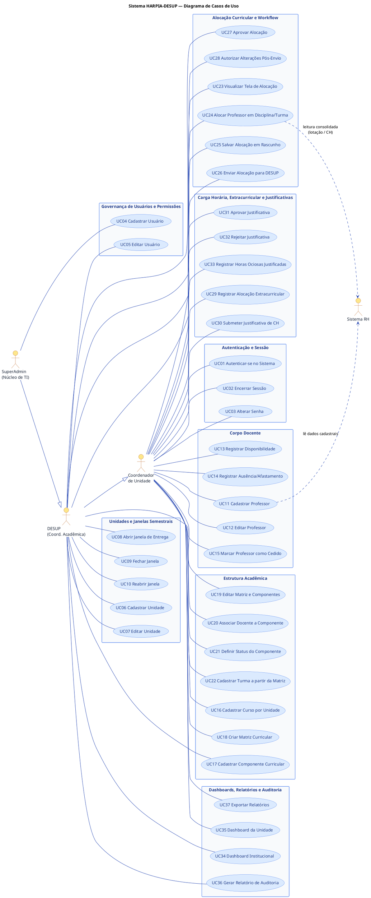

---

## 2. Diagrama de Classes — Estrutura Acadêmica (§6.1)

> Modelo de domínio da estrutura acadêmica e alocação (baseado nas entidades reais do
> sistema: Unidade, Curso, Matriz, Componente, Turma, Professor, Contrato, Alocação e Janela).

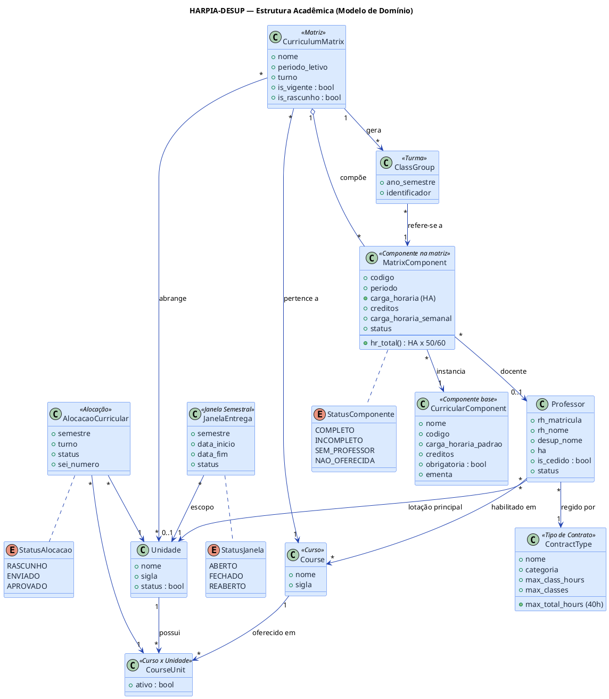

---

## 3. Diagrama de Sequência — UC01 Login e Autenticação (Figura 3)

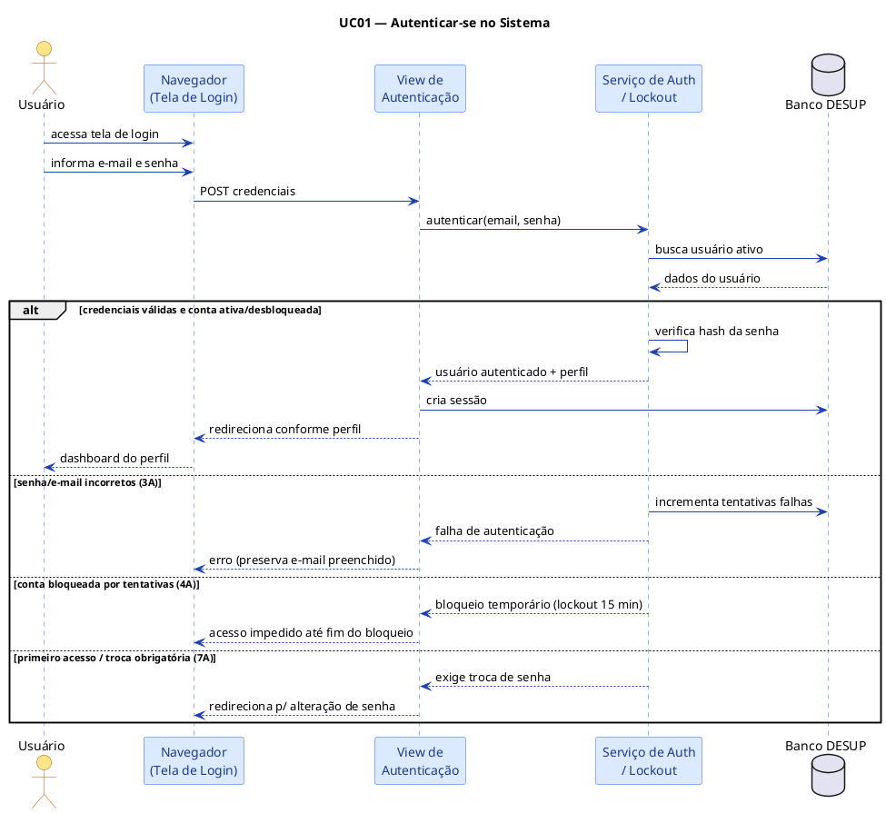

---

## 4. Diagrama de Sequência — Alocar Carga Horária de Professor (Figura 4)

> Corresponde ao **UC24 — Alocar Professor em Disciplina e Turma** (validação das travas 20/40).

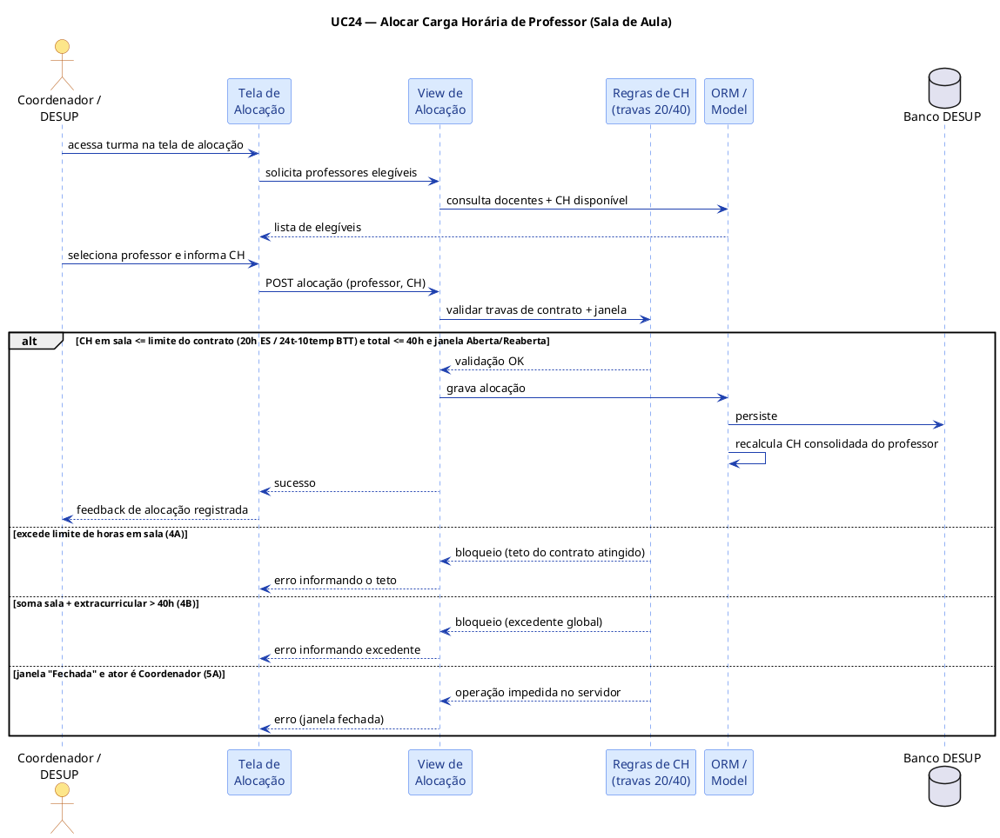

---

## 5. Diagrama de Sequência — Alocar Carga Horária Extracurricular (Figura 5)

> Corresponde ao **UC29 — Registrar Alocação Extracurricular** (TCC, extensão, redução de CH).

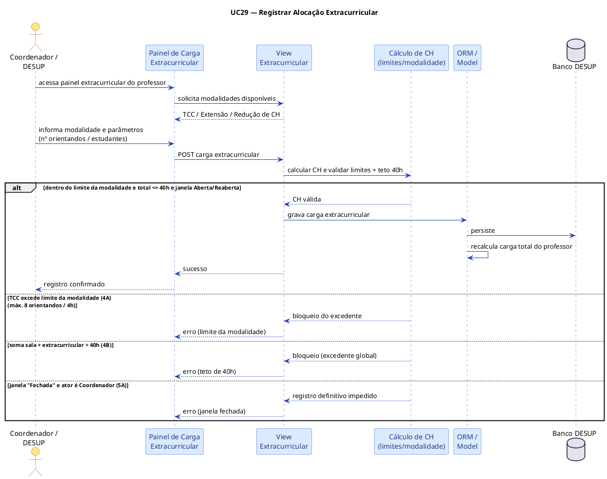

---

## 6. Diagrama de Sequência — Registrar Ausência de Professor

> Corresponde ao **UC14 — Registrar Ausência ou Afastamento de Professor**.

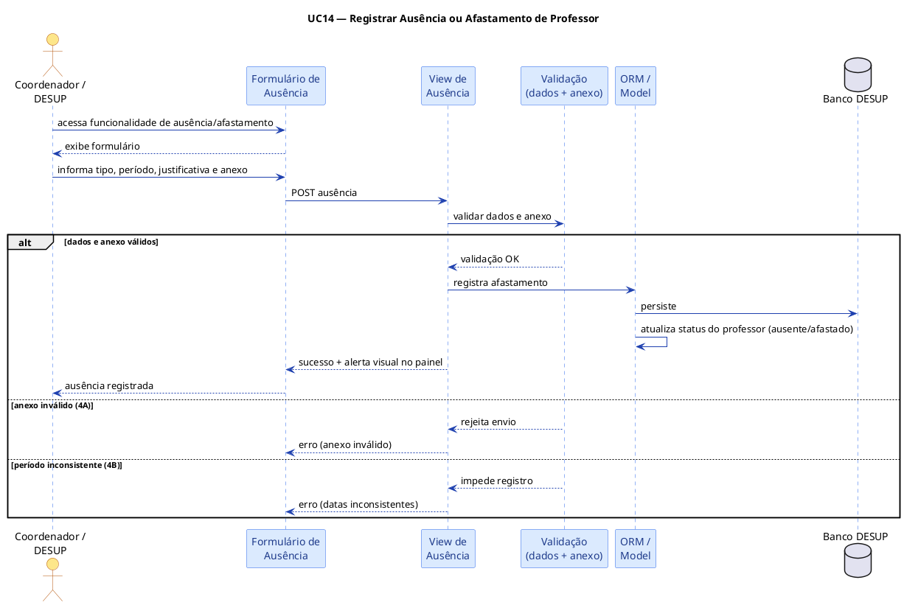

---

## 7. Diagrama de Atividades — UC01 Realizar Autenticação (Login)

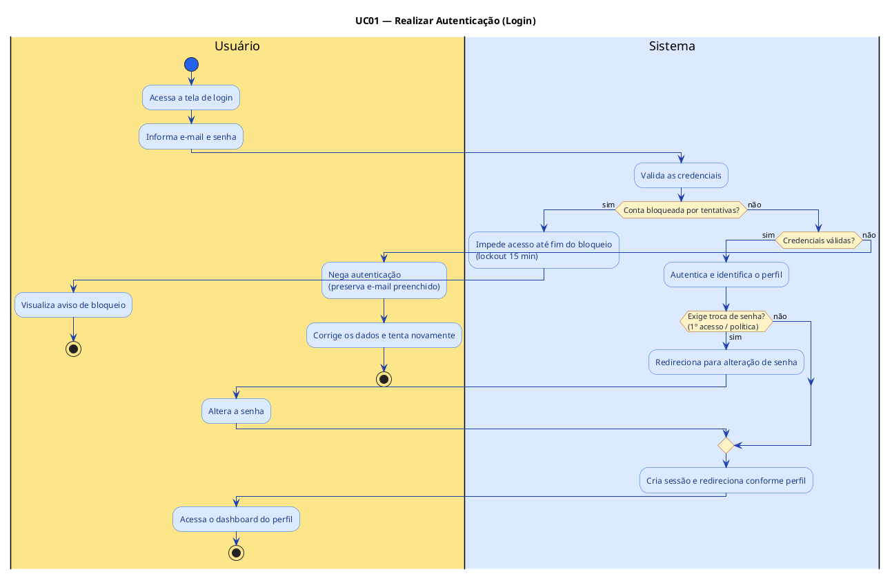

---

## 8. Diagrama de Atividades — UC02 Gerenciar Usuários e Permissões

> Cobre o cadastro/edição de usuários (UC04/UC05).

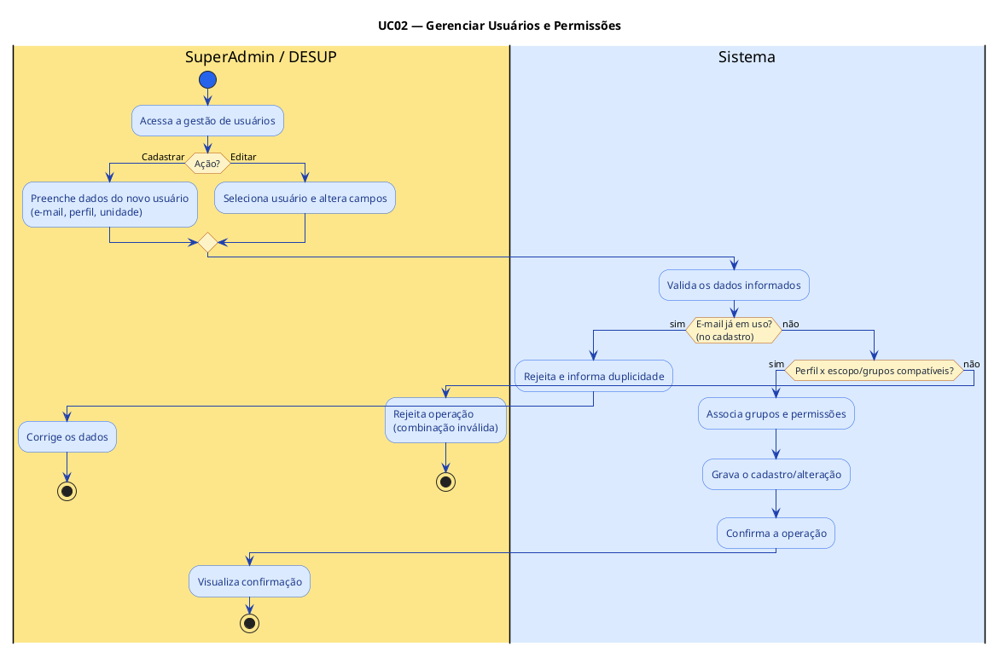

---

## 9. Diagrama de Atividades — UC04 Estruturar Matriz Curricular

> Cobre criar/editar matriz e componentes (UC18/UC19), sob controle da janela semestral.

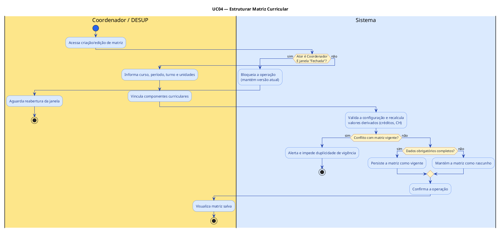

---

## 10. Diagrama de Atividades — UC05 Alocar Carga Horária de Professor (Sala de Aula)

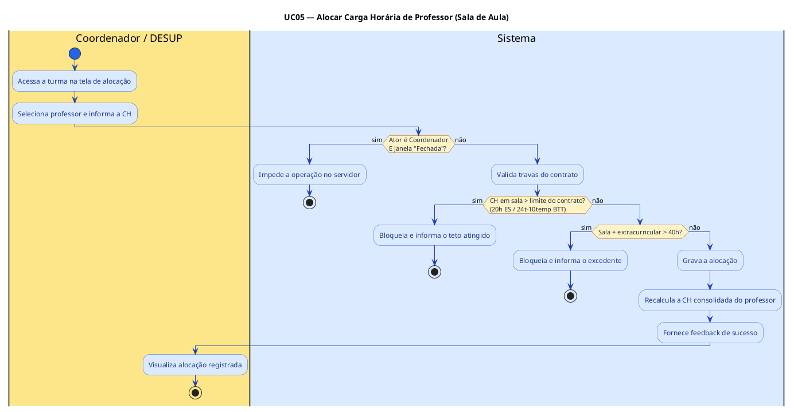

---

## 11. Diagrama de Atividades — UC06 Alocar Carga Horária Extracurricular

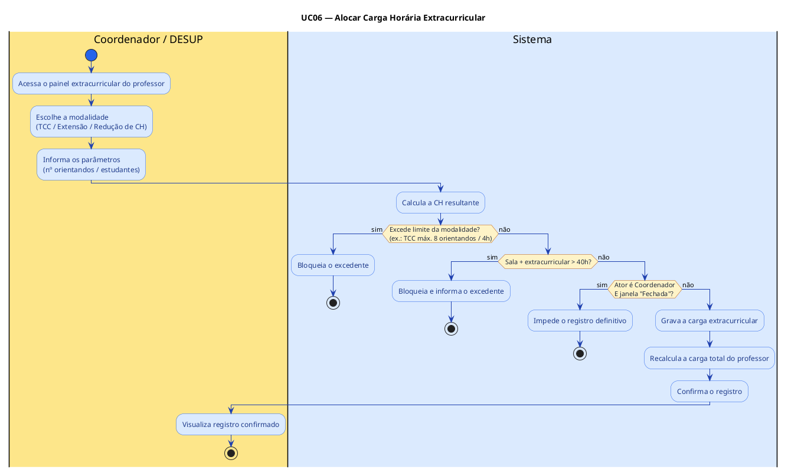

---

## 12. Diagrama de Atividades — UC07 Registrar Ausência de Professor

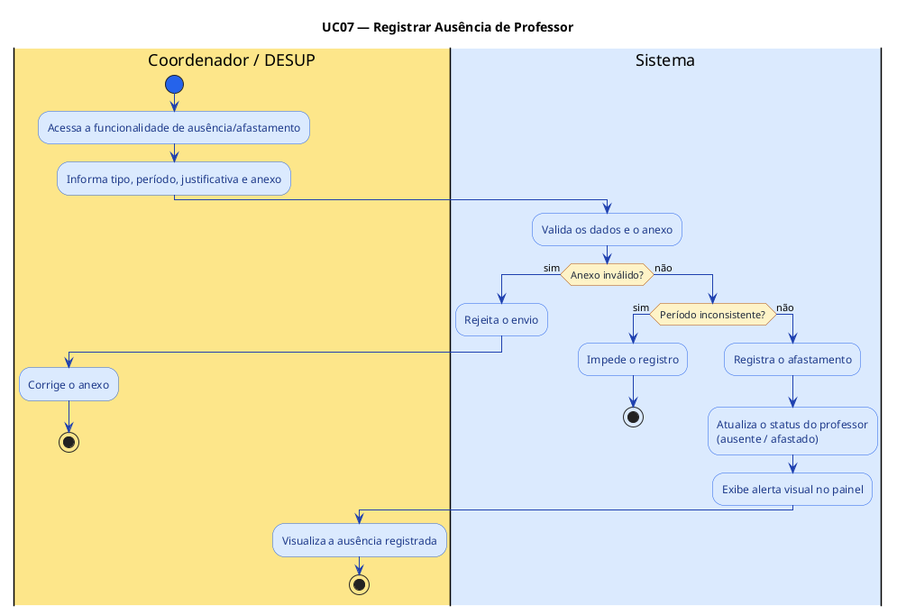

---

## 13. Diagrama de Atividades — UC08 Visualizar Dashboards de Indicadores

> Cobre UC34 (institucional) e UC35 (unidade), com filtro de escopo por perfil.

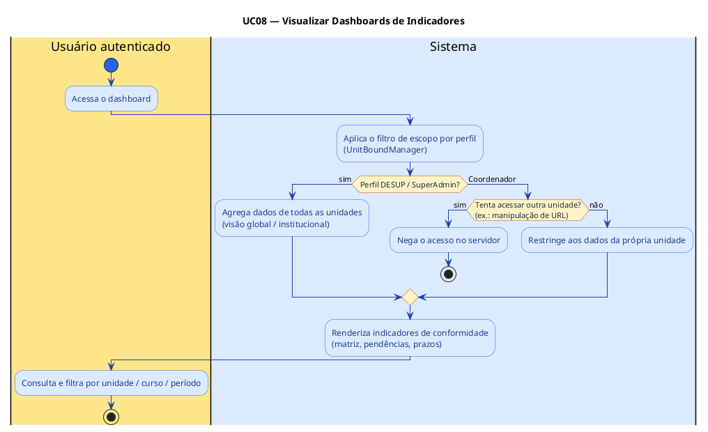

---

*Gerado a partir do "Documento de elicitação de requisitos — Sistema HARPIA-DESUP v2.5",
seções §6.1 (Estrutura Acadêmica), §6.2 (Casos de Uso — Fig. 2), §6.3 (Sequência — Figs. 3–5)
e §6 (Diagrama de Atividades — UC01, UC02, UC04, UC05, UC06, UC07, UC08).*
