# Modelo Conceitual do Banco — HARPIA-DESUP

> Documento **descritivo** gerado a partir da modelagem real (`apps/*/models.py`) na
> branch `main`, para servir de base ao desenho manual do **modelo conceitual (ER)**.
>
> **Escopo deste documento:** entidades, atributos e relacionamentos (o que você
> desenha num diagrama Entidade-Relacionamento / conceitual).
>
> Os **comportamentos** (métodos e propriedades — o que seria a 3ª divisória de uma
> classe UML) estão isolados na **Seção 7**, para quando você quiser montar um
> diagrama de classes/objetos no futuro. Eles **não** entram no modelo conceitual.

---

## 1. Convenções de leitura

| Marca | Significado |
|-------|-------------|
| **PK** | Chave primária. Todo model Django tem um `id` implícito (`BigAutoField`) como PK, salvo indicação. |
| **FK →** | Chave estrangeira (relacionamento N:1 para a entidade apontada). |
| **UQ** | Valor único (unique). |
| **UQ(a,b)** | Unicidade composta (`unique_together`). |
| **N:N** | Relacionamento muitos-para-muitos. |
| **«choices»** | Domínio fechado de valores (enumeração). |
| **/derivado** | Atributo calculado em tempo de leitura (não persiste em coluna). Ver Seção 7. |
| **null ok** | O campo aceita vazio/nulo (participação opcional). |

**Notação de cardinalidade usada na Seção 6 (pé-de-galinha textual):**
`1 —— 0..N` = um-para-muitos com filho opcional; `N —— N` = muitos-para-muitos.

**Módulos (apps) e cor sugerida para o desenho:**
`accounts` (autenticação) · `core` (institucional) · `courses` (estrutura acadêmica) ·
`professors` (corpo docente) · `allocations` (alocação) · `extra_curricular` (justificativas).

---

## 2. Visão geral das entidades (22 entidades)

| # | Entidade | Módulo | Papel no domínio |
|---|----------|--------|------------------|
| 1 | **User** | accounts | Usuário do sistema (login por e-mail, perfil de acesso) |
| 2 | **PasswordResetRequest** | accounts | Solicitação de reset de senha (token) |
| 3 | **SelfPasswordChangeRequest** | accounts | Token de troca de senha pós-primeiro acesso |
| 4 | **Unidade** | core | Unidade de ensino |
| 5 | **JanelaEntrega** | core | Janela semestral de entrega (Aberto/Fechado/Reaberto) |
| 6 | **Notificacao** | core | Aviso a usuário ou unidade |
| 7 | **AuditoriaGlobal** | core | Trilha de auditoria de ações sensíveis |
| 8 | **Course** | courses | Curso (catálogo global) |
| 9 | **CourseUnit** | courses | Curso ofertado em uma unidade (curso × unidade) |
| 10 | **CurricularComponent** | courses | Componente curricular base (disciplina) |
| 11 | **CurriculumMatrix** | courses | Matriz curricular |
| 12 | **MatrixComponent** | courses | Componente vinculado à matriz *(entidade associativa)* |
| 13 | **ClassGroup** | courses | Turma |
| 14 | **ContractType** | professors | Tipo de contrato (travas de CH) |
| 15 | **Professor** | professors | Professor (dados RH + ajustes DESUP) |
| 16 | **Availability** | professors | Disponibilidade (dia/turno) |
| 17 | **AbsenceRecord** | professors | Ausência/afastamento |
| 18 | **AlocacaoCurricular** | allocations | Alocação consolidada (curso/turno/semestre) |
| 19 | **PendenciaExtra** | extra_curricular | Agrupador de justificativas por professor+semestre |
| 20 | **OrientacaoTCC** | extra_curricular | Justificativa — orientação de TCC |
| 21 | **AtividadeExtensionista** | extra_curricular | Justificativa — atividade extensionista |
| 22 | **ReducaoCargaHoraria** | extra_curricular | Justificativa — redução de CH |

> Observação: `UnitBoundManager`/`UnitBoundQuerySet` **não são entidades** — são
> managers (lógica de filtro por unidade) e não geram tabela.

---

## 3. Notas de modelagem importantes (leia antes de desenhar)

1. **RH vs DESUP não são duas tabelas.** A "segregação de bancos" (RN 2.3) é **lógica**,
   dentro da entidade **Professor**: colunas `rh_*` (origem, read-only) convivem com
   colunas `desup_*` (ajustes). A leitura consolidada é resolvida por propriedade
   (`nome`, `email` — Seção 7), não por relacionamento.
2. **MatrixComponent é entidade associativa** (tabela `through`) que resolve o N:N entre
   **CurriculumMatrix** e **CurricularComponent**, carregando atributos próprios
   (carga horária, status, docente etc.). No conceitual, desenhe-a como entidade
   associativa (losango com atributos) — não como simples linha N:N.
3. **AlocacaoCurricular × JanelaEntrega é relacionamento LÓGICO, sem FK.** Não existe
   coluna ligando as duas; a vigência é verificada por consulta (`semestre` + `unidade`).
   No conceitual, você pode representar como relacionamento tracejado/derivado ou apenas
   anotar. Idem para **PendenciaExtra × JanelaEntrega**.
4. **Créditos e CH semanal são derivados** em `MatrixComponent.save()`
   (`creditos = carga_horaria // 20`). São atributos calculados, não entrada do usuário.
5. **Professor cedido (`is_cedido`)** dispara a regra de "carência" na unidade de origem
   (RN 2.4) — é um atributo booleano de domínio, não um relacionamento.
6. **User herda o modelo de auth do Django** (`AbstractUser`): além dos campos abaixo,
   possui `username`, `password`, `is_staff`, `is_superuser`, `is_active`,
   `first_name`, `last_name`, `date_joined`, `last_login` e os N:N herdados
   `groups` (→ Group) e `user_permissions` (→ Permission). Para o conceitual do domínio,
   trate esses como "bloco de autenticação Django" e foque nos campos próprios.

---

## 4. Dicionário de entidades — atributos

### Módulo `accounts`

#### 1. User
| Atributo | Tipo | Restrições / Observações |
|----------|------|--------------------------|
| id | BigAuto | **PK** |
| email | Email | **UQ** · é o `USERNAME_FIELD` (login) |
| perfil | Char «choices» | `DESUP` \| `COORDENADOR_UNIDADE` · default `COORDENADOR_UNIDADE` |
| unidade | FK → **Unidade** | null ok · `SET_NULL` · escopo do coordenador |
| dados_submetidos | Bool | default `False` |
| forcar_troca_senha | Bool | default `True` (troca no 1º acesso) |
| *(herdados)* | — | `username`, `password`, `is_staff`, `is_superuser`, `is_active`, `groups` (N:N), `user_permissions` (N:N) |

#### 2. PasswordResetRequest
| Atributo | Tipo | Restrições / Observações |
|----------|------|--------------------------|
| id | BigAuto | **PK** |
| user | FK → **User** | `CASCADE` · related `reset_requests` |
| token | UUID | **UQ** · não editável |
| criado_em | DateTime | auto |
| finalizado | Bool | default `False` |
| finalizado_em | DateTime | null ok |
| aprovado_por | FK → **User** | null ok · `SET_NULL` · related `aprovacoes_reset` |

#### 3. SelfPasswordChangeRequest
| Atributo | Tipo | Restrições / Observações |
|----------|------|--------------------------|
| id | BigAuto | **PK** |
| user | FK → **User** | `CASCADE` · related `self_password_change_requests` |
| token | UUID | **UQ** · não editável |
| criado_em | DateTime | auto |
| usado | Bool | default `False` |
| usado_em | DateTime | null ok |
| solicitado_ip | IP | null ok |

---

### Módulo `core`

#### 4. Unidade
| Atributo | Tipo | Restrições / Observações |
|----------|------|--------------------------|
| id | BigAuto | **PK** |
| nome | Char(255) | **UQ** · indexado |
| sigla | Char(20) | |
| status | Bool | default `True` (ativa/inativa) |

#### 5. JanelaEntrega
| Atributo | Tipo | Restrições / Observações |
|----------|------|--------------------------|
| id | BigAuto | **PK** |
| semestre | Char(10) | ex.: `2026.1` |
| data_inicio | Date | |
| data_fim | Date | |
| status | Char «choices» | `Aberto` \| `Fechado` \| `Reaberto` · default `Fechado` |
| unidade | FK → **Unidade** | null ok · `CASCADE` · **null = global (todas)** |

#### 6. Notificacao
| Atributo | Tipo | Restrições / Observações |
|----------|------|--------------------------|
| id | BigAuto | **PK** |
| destinatario | FK → **User** | null ok · `CASCADE` · related `notificacoes` |
| unidade_destino | FK → **Unidade** | null ok · `CASCADE` · related `notificacoes_unidade` |
| titulo | Char(255) | default "Nova Notificação" |
| mensagem | Text | |
| lida | Bool | default `False` |
| url_acao | Char(255) | null ok |
| data_criacao | DateTime | auto |

#### 7. AuditoriaGlobal
| Atributo | Tipo | Restrições / Observações |
|----------|------|--------------------------|
| id | BigAuto | **PK** |
| usuario | FK → **User** | null ok · `SET_NULL` · related `eventos_auditoria` |
| email | Email | snapshot do e-mail |
| acao | Char(120) | indexado |
| detalhes | Text | |
| ip | IP | null ok |
| user_agent | Text | |
| criado_em | DateTime | auto · indexado |

---

### Módulo `courses`

#### 8. Course
| Atributo | Tipo | Restrições / Observações |
|----------|------|--------------------------|
| id | BigAuto | **PK** |
| nome | Char(255) | **UQ** |
| sigla | Char(20) | **UQ** |

#### 9. CourseUnit  *(curso × unidade)*
| Atributo | Tipo | Restrições / Observações |
|----------|------|--------------------------|
| id | BigAuto | **PK** |
| curso | FK → **Course** | `CASCADE` · related `course_units` |
| unidade | FK → **Unidade** | `CASCADE` · related `course_units` |
| ativo | Bool | default `True` |
| — | — | **UQ(curso, unidade)** |

#### 10. CurricularComponent
| Atributo | Tipo | Restrições / Observações |
|----------|------|--------------------------|
| id | BigAuto | **PK** |
| nome | Char(255) | |
| sigla | Char(20) | |
| codigo | Char(50) | indexado · pode ser vazio |
| carga_horaria_padrao | PosInt | |
| creditos | PosSmallInt | default `0` |
| obrigatoria | Bool | default `True` |
| pre_requisitos | **N:N → CurricularComponent** | auto-relacionamento assimétrico (related `componentes_dependentes`) |
| ementa | Text | |

#### 11. CurriculumMatrix
| Atributo | Tipo | Restrições / Observações |
|----------|------|--------------------------|
| id | BigAuto | **PK** |
| curso | FK → **Course** | null ok · `CASCADE` · related `matrizes` |
| unidades | **N:N → Unidade** | related `curriculum_matrices` |
| componentes | **N:N → CurricularComponent** | **through `MatrixComponent`** · related `matrizes` |
| nome | Char(100) | "Código da Matriz" (ex.: MC-ADS-2026) |
| is_vigente | Bool | default `True` |
| is_rascunho | Bool | default `False` |
| criada_em | DateTime | auto · null ok |
| periodo_letivo | Char(20) | null ok · ex.: `2026.1` |
| turno | Char(1) «choices» | `M` \| `T` \| `N` · null ok |

#### 12. MatrixComponent  *(entidade associativa Matriz × Componente)*
| Atributo | Tipo | Restrições / Observações |
|----------|------|--------------------------|
| id | BigAuto | **PK** |
| matriz | FK → **CurriculumMatrix** | `CASCADE` · related `componentes_da_matriz` |
| componente_curricular | FK → **CurricularComponent** | `PROTECT` · related `vinculos_matriz` |
| docente | FK → **Professor** | null ok · `PROTECT` · related `componentes_matriz` |
| curso_compartilhado | FK → **CourseUnit** | null ok · `PROTECT` · related `componentes_compartilhados` |
| pre_requisitos | **N:N → CurricularComponent** | related `requisito_em_matrizes` |
| codigo | Char(50) | |
| periodo | Char(50) | ex.: "1º período" |
| carga_horaria | PosInt | |
| creditos | PosSmallInt | **/derivado** = `carga_horaria // 20` |
| compartilhado | Bool | default `False` |
| carga_horaria_semanal | Decimal(5,2) | **/derivado** no `save()` |
| distribuicao_semanal | Text | |
| status | Char «choices» | `COMPLETO` \| `INCOMPLETO` \| `SEM_PROFESSOR` \| `NAO_OFERECIDA` · default `SEM_PROFESSOR` |
| observacoes | Text | |
| — | — | **UQ(matriz, componente_curricular)** |

#### 13. ClassGroup  *(Turma)*
| Atributo | Tipo | Restrições / Observações |
|----------|------|--------------------------|
| id | BigAuto | **PK** |
| matriz_curricular | FK → **CurriculumMatrix** | `CASCADE` · related `turmas` |
| matriz_componente | FK → **MatrixComponent** | null ok · `PROTECT` · related `turmas` |
| ano_semestre | Char(20) | ex.: `2024.1` |
| identificador | Char(50) | ex.: `T01`, `A` |
| — | — | **UQ(matriz_curricular, ano_semestre, identificador)** |

---

### Módulo `professors`

#### 14. ContractType
| Atributo | Tipo | Restrições / Observações |
|----------|------|--------------------------|
| id | BigAuto | **PK** |
| nome | Char(100) | ex.: "Ensino Superior", "BTT" |
| categoria | Char «choices» | `TERCEIRIZADO` \| `EFETIVO` \| `CONCURSADO` · default `EFETIVO` |
| regime_trabalho | Char(20) | ex.: "40h DE" |
| dias_presenca_obrigatorios | PosSmallInt | default `3` |
| max_class_hours | PosInt | **trava de horas em sala** (20 ES / 10-24 BTT) |
| max_total_hours | PosInt | **teto global** · default `40` |
| max_classes | PosInt | limite de turmas |

#### 15. Professor
| Atributo | Tipo | Restrições / Observações |
|----------|------|--------------------------|
| id | BigAuto | **PK** |
| id_funcional | Char(50) | **UQ** · indexado · coluna `ID_FUNCIONAL` |
| rh_matricula | Char(50) | **UQ** · indexado |
| rh_nome | Char(255) | *(origem RH, read-only)* |
| rh_email | Email | null ok *(origem RH)* |
| desup_nome | Char(255) | null ok *(ajuste DESUP)* |
| desup_email | Email | null ok *(ajuste DESUP)* |
| unidade_principal | FK → **Unidade** | null ok · `SET_NULL` · related `professores` |
| tipo_contrato | FK → **ContractType** | `PROTECT` · related `professores` |
| cursos | **N:N → Course** | related `professores_cursos` |
| limite_horas_extra | Decimal(5,1) | null ok |
| is_cedido | Bool | default `False` (dispara carência) |
| ha | PosInt | Horas-Aula semanais · default `0` |
| materia | Char «choices» | eixo (INFO, ELETRO, MECANICA, … OUTROS) · pode ser vazio |
| status | Char «choices» | `Ativo` \| `Afastado` · default `Ativo` |

#### 16. Availability
| Atributo | Tipo | Restrições / Observações |
|----------|------|--------------------------|
| id | BigAuto | **PK** |
| professor | FK → **Professor** | `CASCADE` · related `disponibilidades` |
| dia_semana | Int «choices» | 1=Domingo … 7=Sábado |
| turno | Char(1) «choices» | `M` \| `T` \| `N` |
| — | — | **UQ(professor, dia_semana, turno)** |

#### 17. AbsenceRecord
| Atributo | Tipo | Restrições / Observações |
|----------|------|--------------------------|
| id | BigAuto | **PK** |
| professor | FK → **Professor** | `CASCADE` · related `ausencias` |
| data_inicio | Date | |
| data_fim | Date | |
| motivo | Text | |
| comprovante | File | null ok · upload `ausencias/%Y/%m/` |

---

### Módulo `allocations`

#### 18. AlocacaoCurricular
| Atributo | Tipo | Restrições / Observações |
|----------|------|--------------------------|
| id | BigAuto | **PK** |
| unidade | FK → **Unidade** | `CASCADE` · related `alocacoes_consolidadas` |
| curso | FK → **CourseUnit** | `CASCADE` |
| semestre | Char(10) | ex.: `2026.1` |
| turno | Char(1) «choices» | `M` \| `T` \| `N` |
| status | Char «choices» | `Rascunho` \| `Enviado` \| `Aprovado` · default `Rascunho` |
| sei_numero | Char(50) | null ok · **regex** `SEI-999999/999999/9999` |
| data_criacao | DateTime | auto |
| data_ultimo_ajuste | DateTime | auto (update) |
| — | — | **UQ(curso, semestre, turno)** |
| *(lógico)* | — | vínculo com **JanelaEntrega** por `semestre`+`unidade` (sem FK) |

---

### Módulo `extra_curricular`

#### 19. PendenciaExtra  *(agrupador professor × semestre)*
| Atributo | Tipo | Restrições / Observações |
|----------|------|--------------------------|
| id | BigAuto | **PK** |
| professor | FK → **Professor** | `CASCADE` · related `pendencias_extra` |
| unidade | FK → **Unidade** | `CASCADE` · related `pendencias_extra` |
| criado_por | FK → **User** | null ok · `SET_NULL` · related `pendencias_criadas` |
| semestre | Char(10) | ex.: `2026.1` |
| sei_numero | Char(50) | null ok · **regex** `SEI-999999/999999/9999` |
| status | Char «choices» | `RASCUNHO` \| `ENVIADO` \| `APROVADO` · default `RASCUNHO` |
| motivo_status_desup | Text | |
| data_criacao | DateTime | auto |
| data_atualizacao | DateTime | auto (update) |
| — | — | **UQ(professor, semestre)** |

#### 20. OrientacaoTCC
| Atributo | Tipo | Restrições / Observações |
|----------|------|--------------------------|
| id | BigAuto | **PK** |
| pendencia | FK → **PendenciaExtra** | `CASCADE` · related `orientacoes_tcc` |
| num_orientandos | PosSmallInt | máx **8** |
| num_orientandos_aprovados | PosSmallInt | null ok · máx 8 |
| carga_horaria | Decimal(4,1) | **/derivado** = `orientandos × 0,5` (máx 4h) · não editável |
| horas_aprovadas | Decimal(4,1) | null ok (DESUP) |
| parecer_desup | Char «choices» | `PENDENTE` \| `APROVADO` · default `PENDENTE` |
| motivo_parecer | Text | |
| data_atualizacao | DateTime | auto |

#### 21. AtividadeExtensionista
| Atributo | Tipo | Restrições / Observações |
|----------|------|--------------------------|
| id | BigAuto | **PK** |
| pendencia | FK → **PendenciaExtra** | `CASCADE` · related `atividades_extensao` |
| num_estudantes | PosInt | sem limite |
| num_estudantes_aprovados | PosInt | null ok (DESUP) |
| carga_horaria | Decimal(6,1) | **/derivado** = `estudantes × 0,5` · não editável |
| horas_aprovadas | Decimal(6,1) | null ok (DESUP) |
| parecer_desup | Char «choices» | `PENDENTE` \| `APROVADO` · default `PENDENTE` |
| motivo_parecer | Text | |
| data_atualizacao | DateTime | auto |

#### 22. ReducaoCargaHoraria
| Atributo | Tipo | Restrições / Observações |
|----------|------|--------------------------|
| id | BigAuto | **PK** |
| pendencia | FK → **PendenciaExtra** | `CASCADE` · related `reducoes_ch` |
| motivo_reducao | Text | legislação/aprovação |
| horas_reduzidas | Decimal(5,1) | |
| horas_aprovadas | Decimal(5,1) | null ok (DESUP) |
| parecer_desup | Char «choices» | `PENDENTE` \| `APROVADO` · default `PENDENTE` |
| motivo_parecer | Text | |
| data_atualizacao | DateTime | auto |

---

## 5. Enumerações («choices») — para as caixas de domínio

| Entidade.Campo | Valores |
|----------------|---------|
| User.perfil | DESUP · COORDENADOR_UNIDADE |
| JanelaEntrega.status | Aberto · Fechado · Reaberto |
| CurriculumMatrix.turno / AlocacaoCurricular.turno | M (Manhã) · T (Tarde) · N (Noite) |
| MatrixComponent.status | COMPLETO · INCOMPLETO · SEM_PROFESSOR · NAO_OFERECIDA |
| ContractType.categoria | TERCEIRIZADO · EFETIVO · CONCURSADO |
| Professor.status | Ativo · Afastado |
| Professor.materia | INFO · ELETRO · MECANICA · EDIFICACOES · ADMIN · SAUDE · DESIGN · TELECOM · QUIMICA · TURISMO · FORMACAO · OUTROS |
| Availability.dia_semana | 1=Domingo · 2=Segunda · 3=Terça · 4=Quarta · 5=Quinta · 6=Sexta · 7=Sábado |
| Availability.turno | M · T · N |
| AlocacaoCurricular.status | Rascunho · Enviado · Aprovado |
| PendenciaExtra.status | RASCUNHO · ENVIADO · APROVADO |
| parecer_desup (TCC/Extensão/Redução) | PENDENTE · APROVADO |

---

## 6. Catálogo de relacionamentos (para o desenho ER)

### 6.1 Um-para-muitos (FK)

| Lado 1 (pai) | Card. | Lado N (filho) | Campo FK | On delete |
|--------------|-------|----------------|----------|-----------|
| Unidade | 1 —— 0..N | User | unidade | SET_NULL |
| Unidade | 1 —— 0..N | JanelaEntrega | unidade *(null=global)* | CASCADE |
| Unidade | 1 —— 0..N | Notificacao | unidade_destino | CASCADE |
| Unidade | 1 —— 0..N | CourseUnit | unidade | CASCADE |
| Unidade | 1 —— 0..N | Professor | unidade_principal | SET_NULL |
| Unidade | 1 —— 0..N | AlocacaoCurricular | unidade | CASCADE |
| Unidade | 1 —— 0..N | PendenciaExtra | unidade | CASCADE |
| User | 1 —— 0..N | PasswordResetRequest | user | CASCADE |
| User | 1 —— 0..N | PasswordResetRequest | aprovado_por | SET_NULL |
| User | 1 —— 0..N | SelfPasswordChangeRequest | user | CASCADE |
| User | 1 —— 0..N | Notificacao | destinatario | CASCADE |
| User | 1 —— 0..N | AuditoriaGlobal | usuario | SET_NULL |
| User | 1 —— 0..N | PendenciaExtra | criado_por | SET_NULL |
| Course | 1 —— 0..N | CourseUnit | curso | CASCADE |
| Course | 1 —— 0..N | CurriculumMatrix | curso | CASCADE |
| CourseUnit | 1 —— 0..N | AlocacaoCurricular | curso | CASCADE |
| CourseUnit | 1 —— 0..N | MatrixComponent | curso_compartilhado | PROTECT |
| CurricularComponent | 1 —— 0..N | MatrixComponent | componente_curricular | PROTECT |
| CurriculumMatrix | 1 —— 0..N | MatrixComponent | matriz | CASCADE |
| CurriculumMatrix | 1 —— 0..N | ClassGroup | matriz_curricular | CASCADE |
| MatrixComponent | 1 —— 0..N | ClassGroup | matriz_componente | PROTECT |
| Professor | 1 —— 0..N | MatrixComponent | docente | PROTECT |
| Professor | 1 —— 0..N | Availability | professor | CASCADE |
| Professor | 1 —— 0..N | AbsenceRecord | professor | CASCADE |
| Professor | 1 —— 0..N | PendenciaExtra | professor | CASCADE |
| ContractType | 1 —— 0..N | Professor | tipo_contrato | PROTECT |
| PendenciaExtra | 1 —— 0..N | OrientacaoTCC | pendencia | CASCADE |
| PendenciaExtra | 1 —— 0..N | AtividadeExtensionista | pendencia | CASCADE |
| PendenciaExtra | 1 —— 0..N | ReducaoCargaHoraria | pendencia | CASCADE |

### 6.2 Muitos-para-muitos (N:N)

| Entidade A | Entidade B | Como | Observação |
|------------|------------|------|------------|
| CurriculumMatrix | CurricularComponent | **através de MatrixComponent** | N:N com atributos (entidade associativa) |
| CurriculumMatrix | Unidade | `unidades` | tabela de junção automática |
| Professor | Course | `cursos` | tabela de junção automática |
| CurricularComponent | CurricularComponent | `pre_requisitos` (self, assimétrico) | pré-requisitos padrão |
| MatrixComponent | CurricularComponent | `pre_requisitos` | pré-requisitos por matriz |
| User | Group / Permission | herança Django auth | bloco de autenticação |

### 6.3 Relacionamentos lógicos (sem FK — anote como tracejado)

| A | B | Chave de junção | Onde vive a regra |
|---|---|-----------------|-------------------|
| AlocacaoCurricular | JanelaEntrega | `semestre` + `unidade` | `janela_matriz_ativa` (Seção 7) |
| PendenciaExtra | JanelaEntrega | `semestre` + `unidade` | mesma regra de janela |

---

## 6.4 Diagrama ER (Mermaid — renderiza no GitHub/editores; use como rascunho)

```mermaid
erDiagram
    Unidade ||--o{ User : "lota"
    Unidade ||--o{ JanelaEntrega : "define (null=global)"
    Unidade ||--o{ Notificacao : "destina"
    Unidade ||--o{ CourseUnit : "oferta"
    Unidade ||--o{ Professor : "lota"
    Unidade ||--o{ AlocacaoCurricular : "consolida"
    Unidade ||--o{ PendenciaExtra : "recebe"
    Unidade }o--o{ CurriculumMatrix : "abrange"

    User ||--o{ PasswordResetRequest : "solicita"
    User ||--o{ SelfPasswordChangeRequest : "solicita"
    User ||--o{ Notificacao : "recebe"
    User ||--o{ AuditoriaGlobal : "gera"
    User ||--o{ PendenciaExtra : "cria"

    Course ||--o{ CourseUnit : "ofertado_em"
    Course ||--o{ CurriculumMatrix : "possui"
    Course }o--o{ Professor : "leciona"

    CurricularComponent }o--o{ CurricularComponent : "pre_requisito"
    CurriculumMatrix ||--o{ MatrixComponent : "contem"
    CurricularComponent ||--o{ MatrixComponent : "compoe"
    CourseUnit ||--o{ MatrixComponent : "compartilha"
    Professor ||--o{ MatrixComponent : "ministra"
    CurricularComponent }o--o{ MatrixComponent : "pre_requisito"

    CurriculumMatrix ||--o{ ClassGroup : "gera"
    MatrixComponent ||--o{ ClassGroup : "origina"

    ContractType ||--o{ Professor : "rege"
    Professor ||--o{ Availability : "tem"
    Professor ||--o{ AbsenceRecord : "registra"
    Professor ||--o{ PendenciaExtra : "possui"

    CourseUnit ||--o{ AlocacaoCurricular : "aloca"

    PendenciaExtra ||--o{ OrientacaoTCC : "agrupa"
    PendenciaExtra ||--o{ AtividadeExtensionista : "agrupa"
    PendenciaExtra ||--o{ ReducaoCargaHoraria : "agrupa"

    AlocacaoCurricular }o..o{ JanelaEntrega : "logico (semestre+unidade)"
    PendenciaExtra }o..o{ JanelaEntrega : "logico (semestre+unidade)"
```



> No Mermaid, `||--o{` = um-para-muitos; `}o--o{` = muitos-para-muitos;
> a linha **tracejada** (`}o..o{`) marca os vínculos **lógicos** (sem FK física).

---

## 7. Comportamentos (métodos e propriedades) — **para o diagrama de classes/objetos futuro**

> Esta seção **não** faz parte do modelo conceitual. Guarde para quando for montar o
> diagrama de classes (3ª divisória da classe UML) ou de objetos.
>
> Legenda: `«prop»` = propriedade derivada (poderia virar *atributo derivado* `/nome`
> num diagrama de classes) · `«método»` = operação · `«save»`/`«clean»` = ganchos de
> persistência/validação do Django · `«manager»` = método de manager (nível de classe).

### accounts

**UserManager** «manager»
- `generate_unique_username(base)` — gera username único
- `create_user(email, password, **extra)` — cria usuário (senha padrão se ausente)
- `create_superuser(email, password, **extra)` — cria superusuário

**User**
- «save» `save()` — garante username único no insert
- «método» `__str__()` — `"email (perfil)"`

**PasswordResetRequest**
- «prop» `is_expirado` — expira em 24h
- «método» `__str__()`

**SelfPasswordChangeRequest**
- «prop» `is_expirado` — expira em 1h
- «método» `__str__()`

### core

**Unidade** — «método» `__str__()`

**JanelaEntrega**
- «prop» `is_ativa` — `status != Fechado` **e** hoje dentro de [data_inicio, data_fim]
- «método» `__str__()`

**UnitBoundQuerySet / UnitBoundManager** «manager»
- `for_user(user)` — isola por unidade (DESUP/superuser veem tudo; coordenador só a sua)

**Notificacao** — «método» `__str__()`
**AuditoriaGlobal** — «método» `__str__()`

### courses

**Course**
- «prop» `ha_semanal` → 0 · «prop» `hr_semanal` → 0 *(placeholders)*
- «método» `__str__()`

**CourseUnit**
- «prop» `nome` (delega a `curso.nome`) · «prop» `sigla` (delega a `curso.sigla`)
- «método» `__str__()`

**CurricularComponent** — «método» `__str__()`

**CurriculumMatrix**
- «prop» `total_componentes` — conta componentes da matriz
- «método» `__str__()`

**MatrixComponent**
- «prop» `ha_semanal` — `carga_horaria / 20`
- «prop» `hr_semanal` — `ha_semanal × 50/60`
- «clean» `clean()` — valida compartilhamento (curso obrigatório e diferente do curso da matriz)
- «save» `save()` — define código, calcula `creditos = CH // 20` e `carga_horaria_semanal`
- «método» `__str__()`

**ClassGroup** — «método» `__str__()`

### professors

**ContractType** — «método» `__str__()`

**Professor**
- «prop» `nome` — `desup_nome` ou `rh_nome` (sobrescrita DESUP)
- «prop» `email` — `desup_email` ou `rh_email`
- «prop» `ch_total` — teto do contrato (`max_total_hours`)
- «prop» `ch_justificada` — soma de justificativas **aprovadas** (TCC+extensão+redução)
- «prop» `ch_alocada` — soma de CH em sala na matriz vigente (compartilhado conta 1×)
- «prop» `limite_horas_extra_efetivo` — limite manual ou `max_class_hours − ch_alocada`
- «prop» `ch_nao_alocada` — `ch_total − (ch_alocada + ch_justificada)` (≥ 0)
- «prop» `percentual_alocado` — % alocado, teto 100%
- «prop» `categoria_contrato` — display da categoria do contrato
- «prop» `dias_presenca_obrigatorios` — do contrato
- «método» `get_disciplinas_alocadas()` — disciplinas distintas na matriz vigente
- «clean» `clean()` — matrícula ≠ ID funcional
- «método» `__str__()`

**Availability** — «método» `__str__()`
**AbsenceRecord** — «método» `__str__()`

### allocations

**AlocacaoCurricular**
- «prop» `is_rascunho_expirado` — sempre `False` (rascunho não expira por prazo fixo)
- «prop» `janela_matriz_ativa` — há `JanelaEntrega` Aberta/Reaberta vigente p/ semestre+unidade
- «método» `can_add_carga_horaria_justificada()` → (bool, msg) — depende da janela
- «método» `can_be_sent()` → (bool, msg) — exige SEI + janela ativa
- «método» `__str__()`

### extra_curricular

**PendenciaExtra**
- «prop» `ch_total_justificada` — soma das horas aprovadas (só se status APROVADO)
- «prop» `ch_faltante` — `limite_horas_extra_efetivo − ch_total_justificada` (≥ 0)
- «método» `__str__()`

**OrientacaoTCC**
- «prop» `ch_aprovada` — horas aprovadas DESUP ou calculado (`orientandos × 0,5`, máx 4h)
- «clean» `clean()` — máx 8 orientandos
- «save» `save()` — calcula `carga_horaria` e `horas_aprovadas`
- «método» `__str__()`

**AtividadeExtensionista**
- «prop» `ch_aprovada` — horas aprovadas DESUP ou calculado (`estudantes × 0,5`)
- «save» `save()` — calcula `carga_horaria` e `horas_aprovadas`
- «método» `__str__()`

**ReducaoCargaHoraria**
- «prop» `ch_aprovada` — horas aprovadas DESUP ou `horas_reduzidas`
- «save» `save()` — default de `horas_aprovadas`
- «método» `__str__()`

---

## 8. Sugestão de agrupamento visual (ao desenhar no papel)

1. **Núcleo institucional:** Unidade no centro — quase tudo referencia Unidade.
2. **Bloco autenticação:** User + PasswordResetRequest + SelfPasswordChangeRequest + (Group/Permission Django).
3. **Bloco acadêmico:** Course → CourseUnit; CurricularComponent → (MatrixComponent) → CurriculumMatrix → ClassGroup.
4. **Bloco docente:** ContractType → Professor → (Availability, AbsenceRecord).
5. **Bloco alocação/justificativas:** AlocacaoCurricular; PendenciaExtra → (OrientacaoTCC, AtividadeExtensionista, ReducaoCargaHoraria).
6. Ligue **MatrixComponent.docente → Professor** e **MatrixComponent.componente/matriz** — é o ponto onde o bloco acadêmico encontra o bloco docente.
7. Anote os **vínculos lógicos** (Alocação/Pendência ↔ Janela) como linhas tracejadas.

> Fonte: `project_root/apps/{accounts,core,courses,professors,allocations,extra_curricular}/models.py`
> (branch `main`). Se os models evoluírem, regenerar este documento.
```

