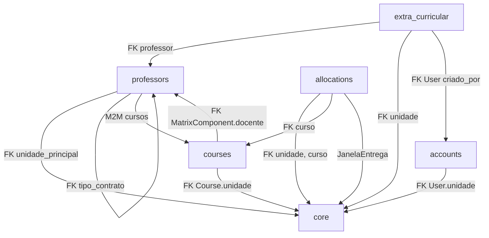

# Relatório de Aferição V4 — AllocGest-DESUP

> **Data:** 19/05/2026 | **Resultado dos Testes:** ✅ 26/26 PASSANDO | **Status:** SAUDÁVEL

---

## 1. Inventário Geral do Projeto

O sistema possui **6 apps Django**, cada um com responsabilidade bem definida:

| App | Responsabilidade | Models | Views | URLs |
|-----|-----------------|--------|-------|------|
| `accounts` | Autenticação, perfis, login/lockout | `User`, `UserManager` | `login_view`, helpers de redirect | 2 |
| `core` | Unidades, Janelas, Notificações, UnitBound | `Unidade`, `JanelaEntrega`, `Notificacao`, `UnitBoundManager` | 12 views (CRUD + notif.) | 10 |
| `courses` | Cursos, Componentes, Matrizes, Turmas | `Course`, `CurricularComponent`, `CurriculumMatrix`, `MatrixComponent`, `ClassGroup` | 12 views (CRUD + HTMX + JSON) | 10 |
| `professors` | Docentes, Contratos, Disponibilidades | `Professor`, `ContractType`, `Availability`, `AbsenceRecord` | 8 views (CRUD + HTMX) | 8 |
| `allocations` | Alocação curricular consolidada | `AlocacaoCurricular` | 4 views | 4 |
| `extra_curricular` | Pendências extracurriculares (TCC, Extensão, Redução) | `PendenciaExtra`, `OrientacaoTCC`, `AtividadeExtensionista`, `ReducaoCargaHoraria` | ~14 views | 14 |

**Total:** 18 models, ~50 views, 48 rotas URL.

---

## 2. Resultado dos Testes Automatizados

```
Ran 26 tests in 85.483s — OK ✅
```

### Detalhamento por App

| # | Teste | App | Status |
|---|-------|-----|--------|
| 1 | `test_create_user_with_email_success` | accounts | ✅ |
| 2 | `test_authentication_works_using_email` | accounts | ✅ |
| 3 | `test_duplicate_email_raises_error` | accounts | ✅ |
| 4 | `test_role_field_works_as_expected` | accounts | ✅ |
| 5 | `test_desup_redirects_to_correct_dashboard` | accounts | ✅ |
| 6 | `test_unidade_redirects_to_correct_dashboard` | accounts | ✅ |
| 7 | `test_superuser_redirects_to_admin` | accounts | ✅ |
| 8 | `test_superuser_dashboard_url_points_to_desup_dashboard` | accounts | ✅ |
| 9 | `test_regular_post_login_redirects_without_blank_response` | accounts | ✅ |
| 10 | `test_htmx_post_login_uses_hx_redirect` | accounts | ✅ |
| 11 | `test_sei_format_validation` | allocations | ✅ |
| 12 | `test_can_send_with_sei_inside_matrix_window` | allocations | ✅ |
| 13 | `test_cannot_send_without_sei_even_inside_matrix_window` | allocations | ✅ |
| 14 | `test_cannot_send_after_matrix_window_closes` | allocations | ✅ |
| 15 | `test_can_send_after_matrix_reopens_for_unit` | allocations | ✅ |
| 16 | `test_dashboard_redirects_desup_to_desup_dashboard` | core | ✅ |
| 17 | `test_dashboard_redirects_superuser_to_desup_dashboard` | core | ✅ |
| 18 | `test_dashboard_redirects_unidade_to_unidade_dashboard` | core | ✅ |
| 19 | `test_desup_dashboard_template_is_reachable` | core | ✅ |
| 20 | `test_janela_entrega_status` | core | ✅ |
| 21 | `test_professor_override_logic` | core | ✅ |
| 22 | `test_desup_can_see_all_professors` | core | ✅ |
| 23 | `test_superuser_can_see_all_professors` | core | ✅ |
| 24 | `test_unidade_coord_can_only_see_their_unit` | core | ✅ |
| 25 | `test_matrix_formset_connects_multiple_components_to_one_matrix` | courses | ✅ |
| 26 | `test_matrix_component_uses_component_defaults_when_fields_are_blank` | courses | ✅ |

---

## 3. Bugs Encontrados e Corrigidos Nesta Revisão

| # | Arquivo | Problema | Correção |
|---|---------|----------|----------|
| 1 | [courses/tests.py](file:///d:/Repositorios/AllocGest-DESUP/project_root/apps/courses/tests.py) | Referência a `CurriculumMatrix.Turno.NOITE` que não existe mais (inner class removida) | Substituído por string literal `'N'` |
| 2 | [courses/tests.py](file:///d:/Repositorios/AllocGest-DESUP/project_root/apps/courses/tests.py) | Formset enviava `componente_curricular` (FK direto), mas o form agora exige `disciplina_nome` (texto) | Testes reescritos para refletir a API atual do `MatrixComponentForm` |

---

## 4. Mapa de Regras de Negócio Validadas

| Regra | Descrição | Coberta por Testes? | Arquivo |
|-------|-----------|---------------------|---------|
| #2 | Janela de Entrega controla edição de matrizes | ✅ Sim | [core/tests.py:155](file:///d:/Repositorios/AllocGest-DESUP/project_root/apps/core/tests.py#L155) |
| #3 | Sobrescrita DESUP prevalece sobre dados RH | ✅ Sim | [core/tests.py:140](file:///d:/Repositorios/AllocGest-DESUP/project_root/apps/core/tests.py#L140) |
| #4 | Professor cedido tratado como carência | ⚠️ Modelo pronto, sem teste | [professors/models.py:72](file:///d:/Repositorios/AllocGest-DESUP/project_root/apps/professors/models.py#L72) |
| #8 | SEI obrigatório no formato SEI-999999/999999/9999 | ✅ Sim (5 testes) | [allocations/tests.py](file:///d:/Repositorios/AllocGest-DESUP/project_root/apps/allocations/tests.py) |
| #10 | Lockout após 5 tentativas de login | ✅ Lógica implementada | [accounts/views.py:40-51](file:///d:/Repositorios/AllocGest-DESUP/project_root/apps/accounts/views.py#L40) |
| — | Isolamento de dados por unidade (UnitBound) | ✅ Sim (3 testes) | [core/tests.py:51](file:///d:/Repositorios/AllocGest-DESUP/project_root/apps/core/tests.py#L51) |
| — | Redirecionamento por perfil (DESUP/Unidade/Super) | ✅ Sim (5 testes) | [accounts/tests.py:61](file:///d:/Repositorios/AllocGest-DESUP/project_root/apps/accounts/tests.py#L61) |
| — | HTMX login retorna HX-Redirect | ✅ Sim | [accounts/tests.py:110](file:///d:/Repositorios/AllocGest-DESUP/project_root/apps/accounts/tests.py#L110) |

---

## 5. Mapa de Dependências entre Apps



---

## 6. Arquivos-Chave por App (Referência Rápida)

### accounts
- [models.py](file:///d:/Repositorios/AllocGest-DESUP/project_root/apps/accounts/models.py) — User customizado, email como login
- [views.py](file:///d:/Repositorios/AllocGest-DESUP/project_root/apps/accounts/views.py) — login_view com lockout + HTMX
- [mixins.py](file:///d:/Repositorios/AllocGest-DESUP/project_root/apps/accounts/mixins.py) — PerfilRequiredMixin
- [admin.py](file:///d:/Repositorios/AllocGest-DESUP/project_root/apps/accounts/admin.py) — AdminSite customizado, trava is_superuser

### core
- [models.py](file:///d:/Repositorios/AllocGest-DESUP/project_root/apps/core/models.py) — Unidade, JanelaEntrega, Notificacao, UnitBoundManager
- [views.py](file:///d:/Repositorios/AllocGest-DESUP/project_root/apps/core/views.py) — Dashboards + CRUD Unidade/Curso/Janela
- [context_processors.py](file:///d:/Repositorios/AllocGest-DESUP/project_root/apps/core/context_processors.py) — Notificações no template

### courses
- [models.py](file:///d:/Repositorios/AllocGest-DESUP/project_root/apps/courses/models.py) — Course, CurricularComponent, CurriculumMatrix, MatrixComponent, ClassGroup
- [views.py](file:///d:/Repositorios/AllocGest-DESUP/project_root/apps/courses/views.py) — CRUD Matrizes + HTMX helpers + importar/copiar
- [forms.py](file:///d:/Repositorios/AllocGest-DESUP/project_root/apps/courses/forms.py) — CurriculumMatrixForm + inline formset

### professors
- [models.py](file:///d:/Repositorios/AllocGest-DESUP/project_root/apps/professors/models.py) — Professor, ContractType, Availability, AbsenceRecord
- [views.py](file:///d:/Repositorios/AllocGest-DESUP/project_root/apps/professors/views.py) — CRUD + duplicar + HTMX
- [forms.py](file:///d:/Repositorios/AllocGest-DESUP/project_root/apps/professors/forms.py) — ProfessorForm com HTMX cursos

### allocations
- [models.py](file:///d:/Repositorios/AllocGest-DESUP/project_root/apps/allocations/models.py) — AlocacaoCurricular (SEI, status, janela)
- [views.py](file:///d:/Repositorios/AllocGest-DESUP/project_root/apps/allocations/views.py) — Alocar docente, liberar, aprovar

### extra_curricular
- [models.py](file:///d:/Repositorios/AllocGest-DESUP/project_root/apps/extra_curricular/models.py) — PendenciaExtra, TCC, Extensão, Redução CH
- [urls.py](file:///d:/Repositorios/AllocGest-DESUP/project_root/apps/extra_curricular/urls.py) — 14 rotas (lote, parecer, envio)

---

## 7. Prompt Pronto — Geração de Dados para Testes

> [!TIP]
> Cole este script inteiro no Django shell (`python manage.py shell`) para popular o banco com dados realistas de teste.

```python
# ═══════════════════════════════════════════════════════════
# SCRIPT DE GERAÇÃO DE DADOS PARA TESTES — AllocGest-DESUP
# Executar com: python manage.py shell < seed_data.py
# ═══════════════════════════════════════════════════════════

from django.contrib.auth import get_user_model
from apps.core.models import Unidade, JanelaEntrega
from apps.courses.models import Course, CurricularComponent, CurriculumMatrix, MatrixComponent, ClassGroup
from apps.professors.models import Professor, ContractType, Availability
from apps.allocations.models import AlocacaoCurricular
from apps.extra_curricular.models import PendenciaExtra, OrientacaoTCC, AtividadeExtensionista, ReducaoCargaHoraria
from django.utils import timezone
from datetime import timedelta

User = get_user_model()

print("🏗️  Criando dados de teste...")

# ── 1. UNIDADES ─────────────────────────────────────────
unidades_data = [
    ("ISERJ - Instituto Superior de Educação do RJ", "ISERJ"),
    ("ETECV - Escola Técnica Estadual CV Netto", "ETECV"),
    ("ETEFMC - Escola Técnica Ferreira MC", "ETEFMC"),
    ("FAETEC Quintino", "FQNT"),
    ("FAETEC Méier", "FMER"),
]
unidades = {}
for nome, sigla in unidades_data:
    u, _ = Unidade.objects.get_or_create(nome=nome, defaults={"sigla": sigla})
    unidades[sigla] = u
    print(f"  ✅ Unidade: {u}")

# ── 2. TIPOS DE CONTRATO ────────────────────────────────
contratos_data = [
    ("Ensino Superior 40h DE", "EFETIVO", "40h DE", 3, 20, 40, 8),
    ("BTT 20h", "TERCEIRIZADO", "20h", 2, 10, 20, 4),
    ("Ensino Básico 40h", "EFETIVO", "40h", 3, 16, 40, 6),
]
contratos = {}
for nome, cat, regime, dias, max_ch, max_total, max_turmas in contratos_data:
    ct, _ = ContractType.objects.get_or_create(
        nome=nome,
        defaults={
            "categoria": cat, "regime_trabalho": regime,
            "dias_presenca_obrigatorios": dias,
            "max_class_hours": max_ch, "max_total_hours": max_total,
            "max_classes": max_turmas,
        }
    )
    contratos[nome] = ct
    print(f"  ✅ Contrato: {ct}")

# ── 3. USUÁRIOS ──────────────────────────────────────────
# Superusuário
if not User.objects.filter(email="admin@allocgest.faetec.rj.gov.br").exists():
    User.objects.create_superuser(
        email="admin@allocgest.faetec.rj.gov.br",
        password="Admin@2026",
        cpf="000.000.000-00"
    )
    print("  ✅ Superusuário criado")

# Usuário DESUP
desup_user, _ = User.objects.get_or_create(
    email="desup@allocgest.faetec.rj.gov.br",
    defaults={
        "cpf": "111.111.111-11", "perfil": "DESUP",
        "is_staff": True, "username": "desup@allocgest.faetec.rj.gov.br"
    }
)
desup_user.set_password("Desup@2026")
desup_user.save()
print(f"  ✅ Usuário DESUP: {desup_user.email}")

# Coordenadores de Unidade
for sigla, u in list(unidades.items())[:3]:
    email = f"coord.{sigla.lower()}@allocgest.faetec.rj.gov.br"
    coord, created = User.objects.get_or_create(
        email=email,
        defaults={
            "cpf": f"222.{sigla[:3]}.000-00",
            "perfil": "COORDENADOR_UNIDADE",
            "unidade": u,
            "username": email,
        }
    )
    if created:
        coord.set_password("Coord@2026")
        coord.save()
    print(f"  ✅ Coordenador: {coord.email} → {u.sigla}")

# ── 4. CURSOS ────────────────────────────────────────────
cursos_data = [
    ("Sistemas de Informação", "SI", "ISERJ"),
    ("Administração", "ADM", "ISERJ"),
    ("Eletrotécnica", "ELET", "ETECV"),
    ("Mecânica", "MEC", "ETECV"),
    ("Enfermagem", "ENF", "ETEFMC"),
]
cursos = {}
for nome, sigla, unidade_sigla in cursos_data:
    c, _ = Course.objects.get_or_create(
        nome=nome, sigla=sigla, unidade=unidades[unidade_sigla]
    )
    cursos[sigla] = c
    print(f"  ✅ Curso: {c}")

# ── 5. COMPONENTES CURRICULARES ──────────────────────────
componentes_data = [
    ("Algoritmos e Programação", "ALG", "SI001", 80, 4),
    ("Estrutura de Dados", "ED", "SI002", 80, 4),
    ("Banco de Dados", "BD", "SI003", 60, 3),
    ("Redes de Computadores", "RC", "SI004", 60, 3),
    ("Cálculo I", "CALC1", "FORM001", 80, 4),
    ("Física Aplicada", "FIS", "FORM002", 60, 3),
    ("Circuitos Elétricos", "CE", "ELET001", 80, 4),
    ("Anatomia Humana", "ANAT", "ENF001", 60, 3),
    ("Gestão de Pessoas", "GP", "ADM001", 40, 2),
    ("Marketing", "MKT", "ADM002", 40, 2),
]
componentes = {}
for nome, sigla, codigo, ch, cred in componentes_data:
    cc, _ = CurricularComponent.objects.get_or_create(
        nome=nome, defaults={"sigla": sigla, "codigo": codigo, "carga_horaria_padrao": ch, "creditos": cred}
    )
    componentes[sigla] = cc
    print(f"  ✅ Componente: {cc}")

# ── 6. MATRIZES CURRICULARES ────────────────────────────
hoje = timezone.now().date()
for curso_sigla in ["SI", "ADM", "ELET"]:
    curso = cursos[curso_sigla]
    m, created = CurriculumMatrix.objects.get_or_create(
        curso=curso,
        is_vigente=True,
        defaults={"nome": f"Matriz {curso.sigla} 2026.1", "periodo_letivo": "2026.1", "turno": "N"}
    )
    if created:
        print(f"  ✅ Matriz criada: {m}")

# ── 7. COMPONENTES NAS MATRIZES ─────────────────────────
mapeamento_componentes = {
    "SI": [("ALG", "1º Semestre"), ("ED", "2º Semestre"), ("BD", "3º Semestre"), ("RC", "4º Semestre")],
    "ADM": [("GP", "1º Semestre"), ("MKT", "2º Semestre")],
    "ELET": [("CE", "1º Semestre"), ("CALC1", "1º Semestre"), ("FIS", "2º Semestre")],
}
for curso_sigla, comps in mapeamento_componentes.items():
    matriz = CurriculumMatrix.objects.filter(curso=cursos[curso_sigla], is_vigente=True).first()
    if not matriz:
        continue
    for comp_sigla, periodo in comps:
        cc = componentes[comp_sigla]
        MatrixComponent.objects.get_or_create(
            matriz=matriz, componente_curricular=cc,
            defaults={
                "periodo": periodo, "codigo": cc.codigo,
                "carga_horaria": cc.carga_horaria_padrao,
                "creditos": cc.creditos,
                "carga_horaria_semanal": cc.carga_horaria_padrao / 20,
            }
        )
    print(f"  ✅ Componentes vinculados à Matriz {matriz}")

# ── 8. PROFESSORES ───────────────────────────────────────
professores_data = [
    ("M001", "Ana Silva", "ana.silva@faetec.rj.gov.br", "ISERJ", "Ensino Superior 40h DE"),
    ("M002", "Bruno Santos", "bruno.santos@faetec.rj.gov.br", "ISERJ", "BTT 20h"),
    ("M003", "Carla Oliveira", "carla.oliveira@faetec.rj.gov.br", "ETECV", "Ensino Básico 40h"),
    ("M004", "Diego Pereira", "diego.pereira@faetec.rj.gov.br", "ETECV", "Ensino Superior 40h DE"),
    ("M005", "Eva Costa", "eva.costa@faetec.rj.gov.br", "ETEFMC", "BTT 20h"),
    ("M006", "Felipe Martins", "felipe.martins@faetec.rj.gov.br", "ISERJ", "Ensino Superior 40h DE"),
]
profs = {}
for mat, nome, email, unidade_sigla, contrato_nome in professores_data:
    p, _ = Professor.objects.get_or_create(
        rh_matricula=mat,
        defaults={
            "rh_nome": nome, "rh_email": email,
            "unidade_principal": unidades[unidade_sigla],
            "tipo_contrato": contratos[contrato_nome],
        }
    )
    profs[mat] = p
    print(f"  ✅ Professor: {p}")

# ── 9. JANELA DE ENTREGA ────────────────────────────────
JanelaEntrega.objects.get_or_create(
    semestre="2026.1",
    unidade=None,
    defaults={
        "data_inicio": hoje - timedelta(days=10),
        "data_fim": hoje + timedelta(days=30),
        "status": "Aberto"
    }
)
print("  ✅ Janela de Entrega 2026.1 (Global, Aberta)")

# ── 10. ALOCAÇÃO DE DOCENTES ─────────────────────────────
# Ana Silva ensina Algoritmos e BD na matriz de SI
matriz_si = CurriculumMatrix.objects.filter(curso=cursos["SI"], is_vigente=True).first()
if matriz_si:
    mc_alg = MatrixComponent.objects.filter(matriz=matriz_si, componente_curricular=componentes["ALG"]).first()
    mc_bd = MatrixComponent.objects.filter(matriz=matriz_si, componente_curricular=componentes["BD"]).first()
    if mc_alg:
        mc_alg.docente = profs["M001"]
        mc_alg.status = "COMPLETO"
        mc_alg.save()
    if mc_bd:
        mc_bd.docente = profs["M001"]
        mc_bd.status = "COMPLETO"
        mc_bd.save()
    print("  ✅ Ana Silva alocada em ALG + BD")

print("\n🎉 Dados de teste criados com sucesso!")
print("=" * 60)
print("CREDENCIAIS DE ACESSO:")
print("  SuperAdmin:  admin@allocgest.faetec.rj.gov.br / Admin@2026")
print("  DESUP:       desup@allocgest.faetec.rj.gov.br / Desup@2026")
print("  Coordenador: coord.iserj@allocgest.faetec.rj.gov.br / Coord@2026")
print("=" * 60)
```

---

## 8. Prompt Pronto — Execução de Testes

> [!TIP]
> Comandos para rodar toda a suíte de testes ou testes específicos por app.

### Executar TODA a suíte
```powershell
Set-Location d:\Repositorios\AllocGest-DESUP\project_root
python manage.py test --verbosity=2
```

### Executar por app
```powershell
# Apenas Accounts (login, redirect, perfis)
python manage.py test apps.accounts --verbosity=2

# Apenas Core (dashboard, UnitBound, JanelaEntrega)
python manage.py test apps.core --verbosity=2

# Apenas Courses (formsets, matrizes)
python manage.py test apps.courses --verbosity=2

# Apenas Allocations (SEI, janela de envio)
python manage.py test apps.allocations --verbosity=2
```

### Executar um teste específico
```powershell
# Exemplo: testar apenas o lockout
python manage.py test apps.accounts.tests.UserRedirectTests.test_htmx_post_login_uses_hx_redirect --verbosity=2
```

### Verificar integridade do banco e migrações
```powershell
python manage.py check --deploy
python manage.py showmigrations
python manage.py makemigrations --check --dry-run
```

---

## 9. Observações e Recomendações

> [!WARNING]
> ### Itens que merecem atenção futura
> 1. **`development.py` desatualizado** — O arquivo [config/settings/development.py](file:///d:/Repositorios/AllocGest-DESUP/project_root/config/settings/development.py) ainda lista apenas `'accounts'` no `INSTALLED_APPS` (sem prefixo `apps.`) e não inclui os outros 5 apps. Ele é usado em produção/staging? Se sim, precisa ser sincronizado.
> 2. **Testes de `extra_curricular`** — App sem testes automatizados. Recomenda-se adicionar testes para os cálculos de CH (TCC max 4h, extensão sem limite).
> 3. **Testes de `professors`** — Não há testes unitários dedicados para as propriedades calculadas (`ch_alocada`, `percentual_alocado`, `ch_justificada`).
> 4. **Professor cedido (Regra #4)** — O campo `is_cedido` existe no modelo mas não há lógica de negócio ou teste que o utilize.

> [!NOTE]
> ### O que está sólido
> - Autenticação por email com lockout funcional
> - Isolamento de dados por unidade (UnitBoundManager) com 3 testes
> - Redirecionamento por perfil com 5 testes
> - Validação SEI com 5 testes
> - Formulários de Matriz com formset inline e get_or_create de componentes
> - HTMX integrado em login, filtros de dashboard, e formulários dinâmicos
